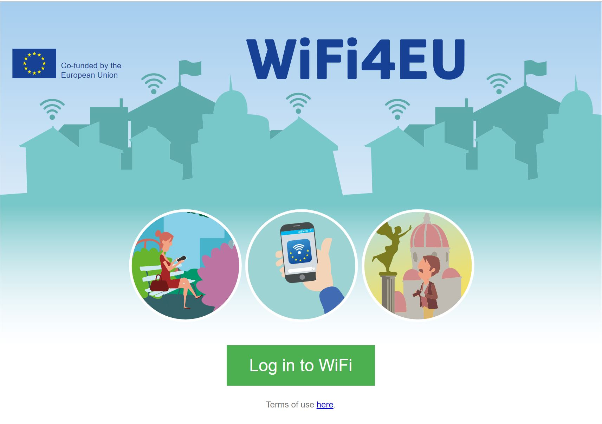

#  Meraki Wifi4EU Captive Portal
*Static HTML/JS/CSS Site for a Click-through Splash Page with Wifi4EU tracking snippet integration*


## Overview
The Wifi4EU programme requires the use of a captive portal that connects to the Wifi4EU metrics infrastructure. You can read more about this here: https://ec.europa.eu/digital-single-market/en/news/wifi4eu-tracking-snippet-guideline

Cisco Meraki provides cloud managed WiFi with the ability to host your own "Splash Page", which is a captive portal service for authenticating users to join the network. This concept is called an External Captive Portal (ExCaP). 

Meraki provides two splash page modes, **click-through** and **sign-on**. This application will use the click-through method.

To get started just host these files in the public directory on any web server such as nginx, Apache or Firebase Hosting and configure your Meraki SSID to use your server. 

## Installation
* Edit variable wifi4euNetworkIdentifier in index.html to match your WiFi4EU UUID.
* Host the public directory files on a static webserver such as nginx, Apache, GitHub or Firebase, or use the included NodeJS express server. 
* Configure the Meraki wireless SSID with a Click-Through splash page authentication
    * Meraki Dashboard --> Configure --> Splash Page: Click-through
* Add the domain address of the webserver and the Wifi4EU resources to the "Walled Garden" 
    * Meraki Dashboard --> Configure --> Access Control --> SSID:yourSSID --> Walled Garden.
    * The domain for the Wifi4EU resources is **collection.wifi4eu.ec.europa.eu**
    * Note: You will need to use the IP addresses associated with these resources instead of their domain names or contact Meraki Support to enable Walled Garden Domain Names
* Point the Meraki Splash page "Customer URL" to the HTML file. `https://yourserver/`
    * Meraki Dashboard --> Configure --> Splash Page --> Custom URL: `https://yourserver.com/splash.html`

* **Option 1:** Static Web Server 
(Apache, nginx, Firebase Hosting)
   * Copy public directory to server
* **Option 2:** NodeJS Server
   * In the root directory of the project, run 
```
npm install
node server.js
```
- The server will host the project on port 5000.


## Sample URL paramater string
```
https://yourserver/index.html?base_grant_url=https%3A%2F%2Fn143.network-auth.com%2Fsplash%2Fgrant&user_continue_url=http%3A%2F%2Fask.com%2F&node_id=149624921787028&node_mac=88:15:44:50:0a:94&gateway_id=149624921787028&client_ip=10.110.154.195&client_mac=60:e3:ac:f7:48:08:22
```

## Screenshot



## Additional Resources
https://developer.cisco.com/meraki/captive-portal-api/

### Based on example code by
Cory Guynn
2017
www.InternetOfLEGO.com


